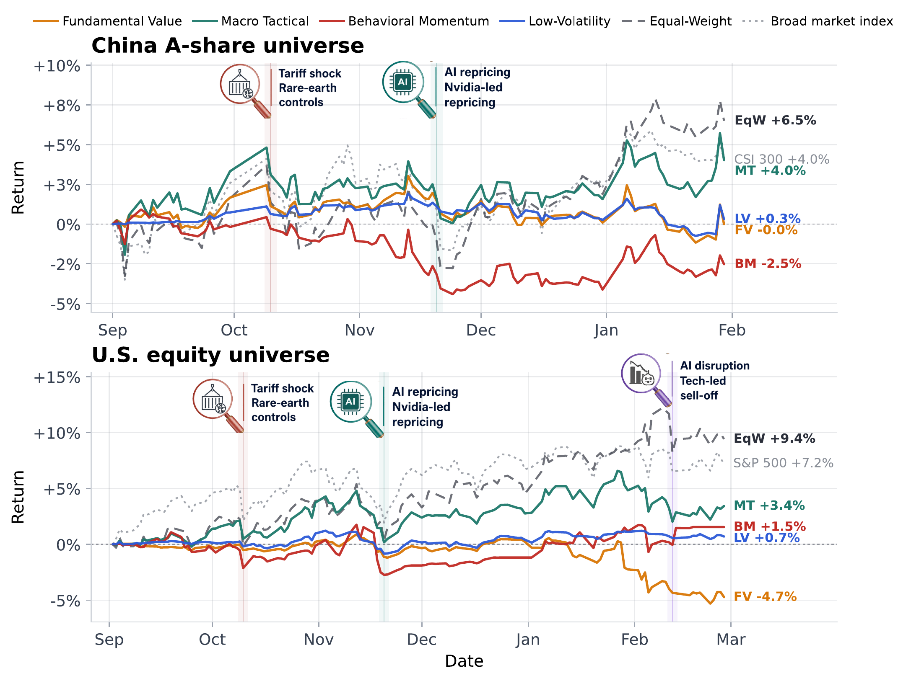
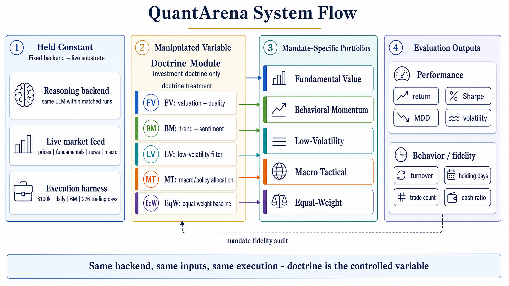
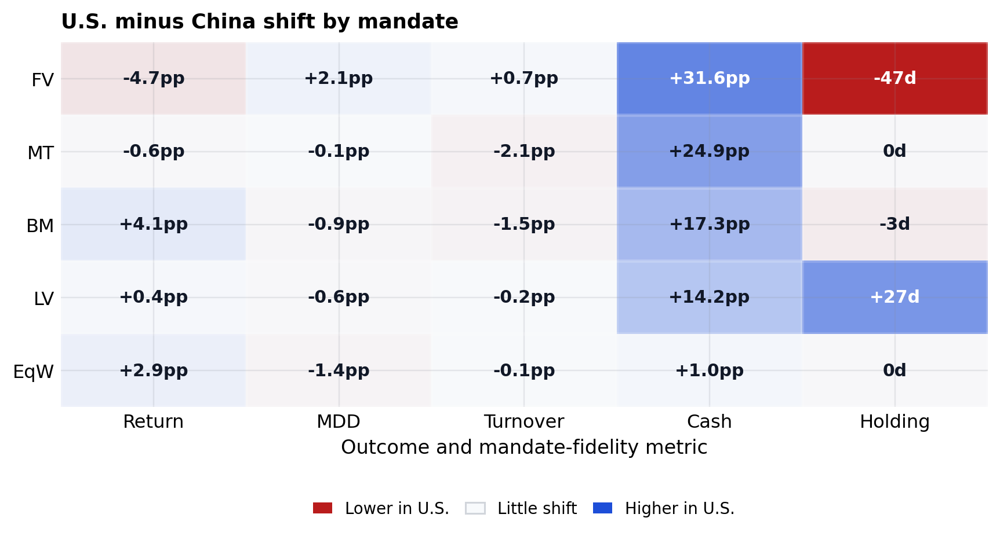
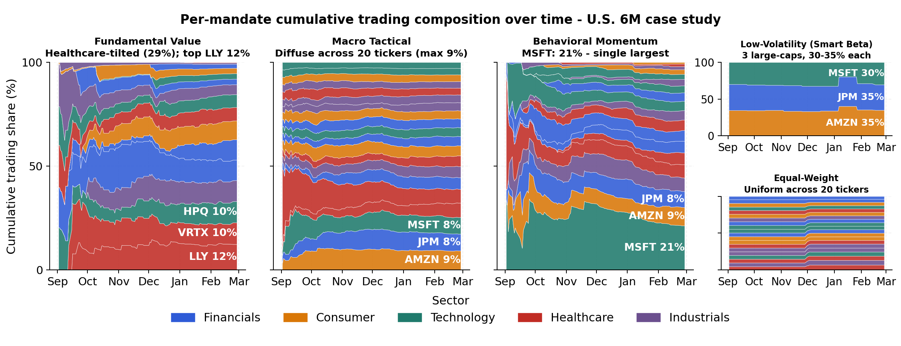

# QuantArena

**Benchmark the policy, not just the model.**

[](https://dominic789654.github.io/quantarena-clean/)
[](docs/INSTALL.md)
[](LICENSE)

QuantArena is an open research toolkit for policy-conditioned live-market
evaluation of LLM trading agents. It fixes the reasoning backend, market data,
analyst workflow, capital, accounting, and execution harness, then varies only
the executable investment mandate.

<p>
  <a href="https://dominic789654.github.io/quantarena-clean/"><strong>Project homepage</strong></a>
  ·
  <a href="docs/reproduction.md">Reproduction notes</a>
  ·
  <a href="docs/INSTALL.md">Install</a>
  ·
  <a href="docs/DEVELOPMENT.md">Development</a>
</p>

<p align="center">
  
</p>

## Why QuantArena?

Most LLM trading evaluations entangle model capability, framework design, and
investment strategy. QuantArena makes the investment doctrine the controlled
variable:

- Same backend, market feed, analyst pool, capital, accounting, and execution.
- Swappable executable mandates: `Fundamental Value`, `Macro Tactical`,
  `Behavioral Momentum`, `Low-Volatility`, and `Equal-Weight`.
- Evaluation covers both performance and behavior: return, drawdown, volatility,
  cash, turnover, holding period, trades, and portfolio composition.

<p align="center">
  
</p>

## At a Glance

| Axis | Current artifact |
| --- | --- |
| Markets | China A-share and U.S. equities |
| Universe | 40 matched tickers across two 20-name windows |
| Horizon | 226 total trading days |
| Policies | Fundamental Value, Macro Tactical, Behavioral Momentum, Low-Volatility, Equal-Weight |
| Diagnostics | Return, drawdown, volatility, cash, turnover, holding period, trade count, composition |

## Main Results

In matched six-month China A-share and U.S. equity case studies, the
Equal-Weight baseline leads both markets, while Macro Tactical is the closest
active mandate. The active doctrines still produce distinct behavior in cash
usage, turnover, holding period, and portfolio formation.

<p align="center">
  
</p>

<p align="center">
  
</p>

## Repository Layers

- `quantarena/`: stable CLI, smoke checks, and artifact validation.
- `backtest/`: portfolio metrics, mandate engines, and reporting support.
- `deepfund/`: trading analysis, provider routing, profiles, and execution code.
- `deepear/`: intelligence and report-generation workflow components.
- `tests/`: unit and focused regression tests.

## Quick Start

### Requirements

- Python 3.11+
- Optional market-data keys for live provider checks, such as Tushare, Alpha Vantage, or
  FMP
- Optional LLM keys for LLM-conditioned runs, such as Ark, DeepSeek, OpenAI, or
  OpenRouter

### Install

```bash
python -m venv .venv_unified
source .venv_unified/bin/activate
pip install -e .
```

The editable install pulls the default runtime stack for CLI checks, provider smoke
checks, reports, and ordinary backtests. Use an isolated virtual environment.

For development checks:

```bash
pip install -e ".[dev]"
```

The default install supports the CLI, provider smoke checks, reports, and ordinary
backtests. Predictor and embedding experiments that import `torch`, `transformers`, or
`sentence-transformers` are optional:

```bash
pip install -e ".[ml]"
```

To install every optional development and ML dependency:

```bash
pip install -e ".[full]"
```

Copy `.env.example` only when you need live provider or LLM calls:

```bash
cp .env.example .env
```

Do not commit `.env`, credentials, local reports, release mirrors, or generated paper
artifacts.

## No-Network Checks

Run the source-checkout smoke test after cloning or switching branches:

```bash
python -m quantarena.cli smoke --json
```

If you have a local release bundle, validate it without contacting remote hosts:

```bash
python -m quantarena.cli evaluate --root release_data --json
```

Use `artifact validate` and `artifact summary` when you need the granular validation or
summary commands directly.

Use strict artifact validation only when the local release bundle is present and warnings
should fail the release gate:

```bash
python -m quantarena.cli evaluate --root release_data --json --strict
```

See [docs/reproduction.md](docs/reproduction.md) for what these checks do and do not
validate.

## Runtime Entry Points

The stable utility CLI is:

```bash
quantarena --help
python -m quantarena.cli --help
```

Research workflows can be launched through the stable CLI wrapper:

```bash
quantarena run --help
```

The wrapper forwards arguments to the existing experiment runner, which remains available
directly for DeepEar, DeepFund, backtest, and multi-policy workflows:

```bash
python run.py --help
```

Example backtest invocation:

```bash
python run.py \
  --mode backtest \
  --tickers "600519,000858" \
  --start-date 2024-01-01 \
  --end-date 2024-01-31 \
  --market cn
```

Before adding `--use-llm`, run `python run.py --check-env` and confirm that a real API
smoke run is intended.

## Repository Layout

```text
quantarena/      Stable CLI and artifact-validation utilities
deepfund/        Trading analysis, provider routing, profiles, and backtest code
deepear/         Intelligence workflow and report-generation components
shared/          Shared configuration, database, LLM, and utility code
backtest/        Backtest support modules
tests/           Unit and focused regression tests
docs/            Project documentation and refactor notes
run.py           Research experiment runner
```

Local-only workspaces such as `release_data/`, `latex/`, `reports/`, `experiments/`, and
`data/` are intentionally outside the tracked runtime package boundary. See `.gitignore`
for the full generated-artifact list.

## Development Workflow

Use branch-and-PR development. Each PR should state behavior impact, tests run,
reproduction risk, whether real API checks were needed, and whether a review agent was
used. Runtime, provider, LLM, artifact, or broad workflow changes should be reviewed
before merge.

Start with:

```bash
git status -sb
git diff --check
python -m quantarena.cli smoke --json
```

Then run focused tests for the modules you changed. See [docs/DEVELOPMENT.md](docs/DEVELOPMENT.md)
for the current PR checklist, real API smoke policy, artifact-validation workflow, and
where to add new mandates or providers.

## Documentation Index

| Document | Contents |
| --- | --- |
| [INSTALL.md](docs/INSTALL.md) | Detailed installation notes |
| [API.md](docs/API.md) | Data providers and API notes |
| [DEVELOPMENT.md](docs/DEVELOPMENT.md) | Branch, PR, test, review, and API-smoke workflow |
| [reproduction.md](docs/reproduction.md) | Artifact validation and reproduction checks |

## License

MIT License. See LICENSE for details.
